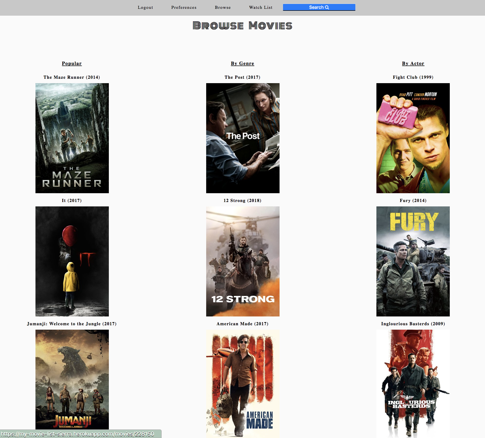
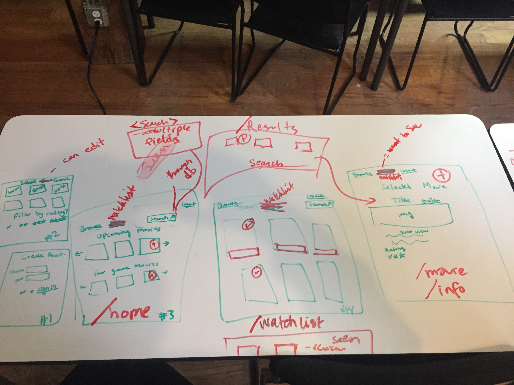
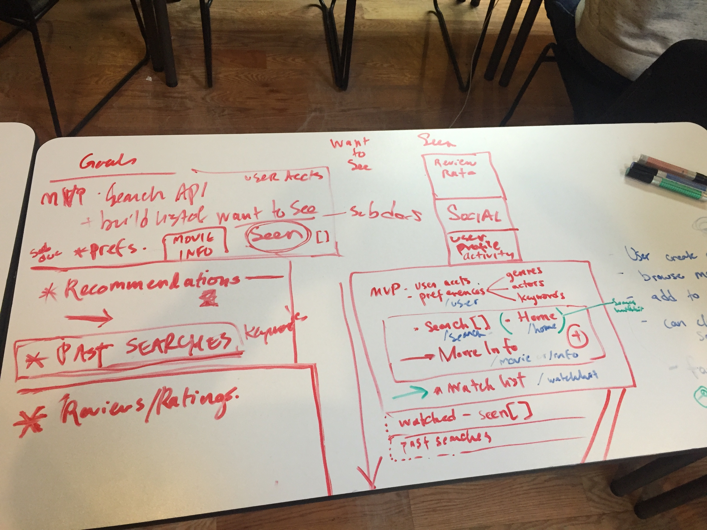
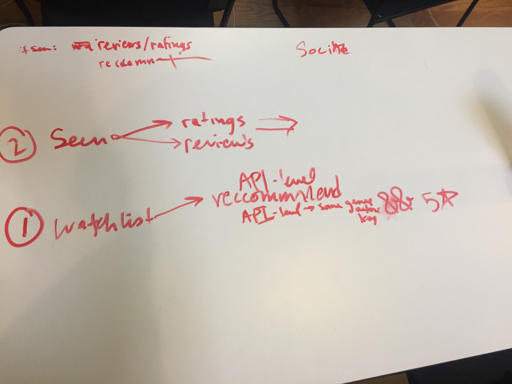

## My Movie List

#### What is this?

This was created so a user can store and manage a list of all of the movies they want to be able to see. 

	After creating an account a user is able to:
	• Set their favorite genres, actors, actresses, directors, producers, in preferences
	• A user is shown a random selection of popular movies, their favorite genres, and their favorite actors in the browse page
	• A user can search for movies off of a variety of criteria (title keywords, genre, minimum rating, person keywords)
	• Users can click on specific titles to view more information about the movie
	• Users can add movies to their watch list to keep track of their favorites
	• Users can manage their watchlist be removing movies they have seen.

#### What technologies were used?

We used, JavaScript, Node.js, Css, EJS, Mongoose, Express.js, MongoDB, and a movie database API (see below).
 
   This product uses the TMDb API but is not endorsed or certified by TMDb.

#### Who created this project and why?
The following collaborators contributed to this project: 
	Anthony Lower @ https://github.com/anthonyjlower  
	Sierra Moore @ https://github.com/sierramoore
	Somers Matthews @ https://github.com/somersbmatthews

We wanted to create a CRUD app that allows for multiple API calls in sequence that provide useful information to the user.

##### Future Goals:

* Add selected movies to their “Already watched list”
* Rate and review movies they have watched
* See recommendations on their homepage based off of their watched history
* See other users ratings and reviews on the movie specific pages 
* Able to add additional criteria to preferences  

###### This website is available for use at: 
https://my-movie-list-sierra.herokuapp.com/users/register

The project repo for this website is at: https://github.com/sierramoore/my_movie_list

### Wireframes

 